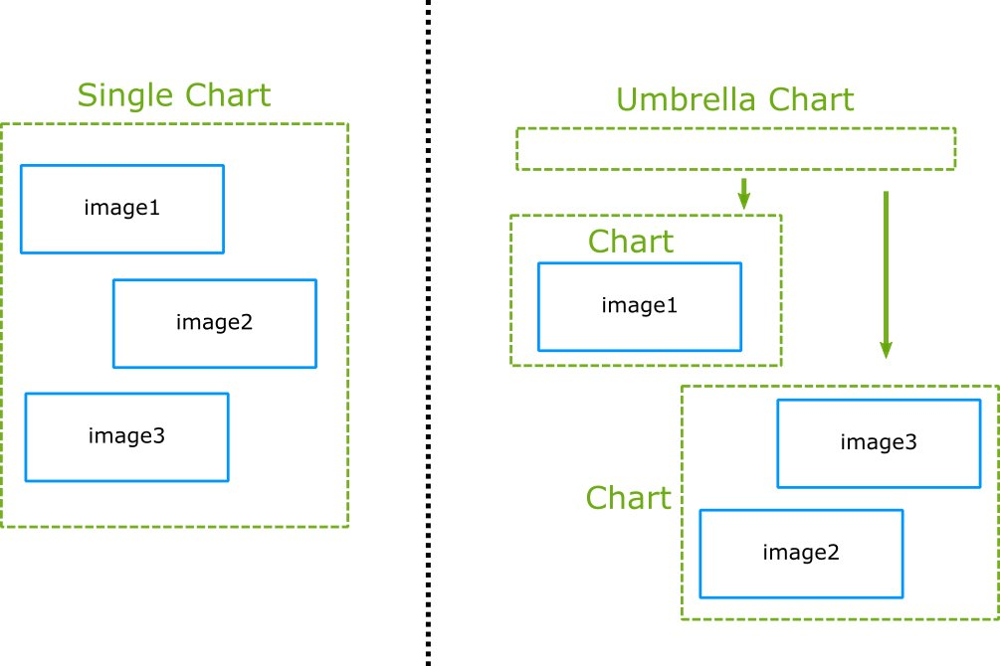

# Helm

Helm is a package manager for Kubernetes (think apt or yum). It works by combining several manifests into a single package that is called a chart. Helm also supports chart storage in remote or local Helm repositories that function like package registries such as Maven Central, Ruby Gems, npm registry, etc.

Helm is currently the only solution that supports

- The grouping of related Kubernetes manifests in a single entity (the chart)
- Basic templating and value support for Kubernetes manifests
- Dependency declaration between applications (chart of charts)
- A registry of available applications to be deployed (Helm repository)
- A view of a Kubernetes cluster in the application/chart level
- Management of installation/upgrades of charts as a whole
- Built-in rollback of a chart to a previous version without running a CI/CD pipeline again

You can find a list of public curated charts in the [default](https://github.com/helm/charts/tree/master/stable) Helm repository.

## Common Helm misconceptions

Any new technology requires training on how to use it effectively. If you have already worked with any type of package manager, you should be familiar with how Helm works.

Here is a list of important Helm points that are often controversial between teams.

### Helm repositories are optional

Using Helm repositories is a recommended practice, but completely optional. You can deploy a Helm chart to a Kubernetes cluster directly from the filesystem.

Helm can install a chart either in the package (.tgz) or unpackaged form (tree of files) to a Kubernetes cluster right away. Thus, the most minimal Helm pipeline has only two steps:

- Checkout from git a Helm chart described in uncompressed files.
- Install this chart to a Kubernetes cluster.

### Chart versions and appVersions

Each Helm chart has the ability to define two separate versions:

- The version of the chart itself (version field in Chart.yaml).
- The version of the application contained in the chart (appVersion field in Chart.yaml).

These are unrelated and can be bumped up in any manner that you see fit. You can sync them together or have them increase independently. There is no right or wrong practice here as long as you stick into one.

### Charts and sub-charts

The most basic way to use Helm is by having a single chart that holds a single application. The single chart will contain all the resources needed by your application such as deployments, services, config-maps etc.

However, you can also create a chart with dependencies to other charts (a.k.a. umbrella chart) which are completely external using the requirements.yaml file. Using this strategy is optional and can work well in several organizations. Again, there is no definitive answer on right and wrong here, it depends on your team process.

### Helm vs K8s templates

Helm is a package manager that also happens to include templating capabilities. Unfortunately, a lot of people focus only on the usage of Helm as a template manager and nothing else.

Technically Helm can be used as only a templating engine by stopping the deployment process in the manifest level. It is perfectly possible to use Helm only to create plain Kubernetes manifests and then install them on the cluster using the standard methods (such as kubectl). But then you miss all the advantages of Helm (especially the application registry aspect).

At the time of writing Helm is the only package manager for Kubernetes, so if you want a way to group your manifests and a registry of your running applications, there are no off-the-shelf alternative apart from Helm.

Here is a table that highlights the comparison:

Helm Feature |	Alternative
--- | --- 
Templating |	Kustomize, k8comp, kdeploy, ktmpl, kuku, jinja, sed, awk, etc.
Manifest grouping (entity/package) |	None
Application/package dependencies |	None
Runtime view of cluster packages |	None
Registry of applications |	None
Direct rollbacks and Upgrades	None
