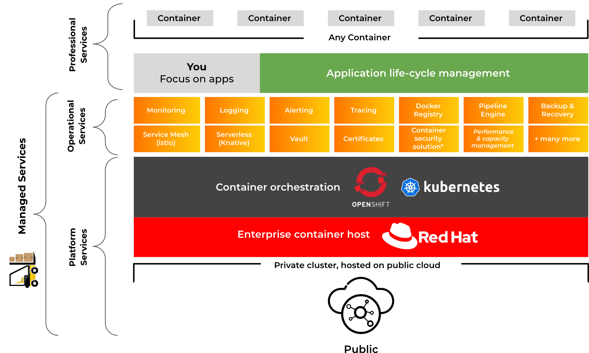
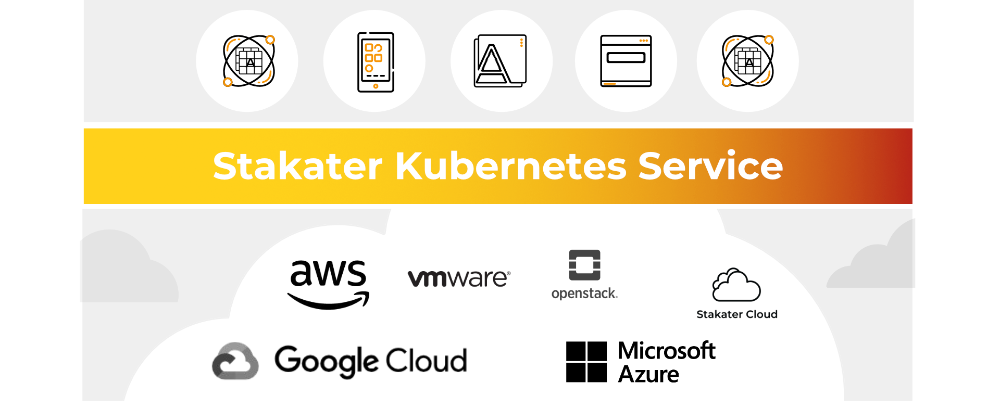

# Introducing SKS (Stakater Kubernetes Service)

Organizations have adopted containers and Kubernetes to automate their applications operations and make their business applications portable, secure, easy to manage and scalable. While booting a Kubernetes cluster is fairly painless, a production grade Kubernetes environment can be complex, and require significant expertise to operate. Additionally managing an application platform on top of that is considerably challenging. Companies not only require an application stack for running their business processes, they need such an application stack to be configurable yet consistent and auditable, upgradable and devops enabled yet upgradable and cost-effective.

Companies require a solution with a justifiable return on their investment.

Built by open source leaders, Red Hat® OpenShift® is the leading enterprise Kubernetes platform. Stakater Red Hat OpenShift (SRO) is a fully managed enterprise Kubernetes platform hosted on AWS, Google, Azure, VMWare, OpenStack & Stakater Cloud. With Stakater Red Hat OpenShift (SRO), innovators can focus on what matters, stay competitive, and outpace rising customer expectations without worrying about managing the underlying infrastructure.

With Stakater Red Hat Openshift (SRO), Stakater builds and manages your OpenShift clusters, allowing you to focus on your business. We offer SRO for on-premises or your choice of public cloud allowing you to optimize your multi-cloud strategy that best suits your needs. SRO enables your teams across your organizations to consume OpenShift as a Service.

## Why it makes sense for companies

- Quicker return on investment > Get up and running quickly
- Reduce Operational Overhead > Fully managed from infrastructure to day to day operations
- SRE Support > Enhance security with automated patching and upgrades with zero downtime
- Empower Developer productivity > Focus on developing apps that add value to the business
- Flexible consumption based pricing >Optimize costs with flexible pay-as-you-go pricing model (monthly binding)

## Solution Overview

With Stakater Red Hat OpenShift you can deploy a containerized, hybrid environment to meet digital business needs for running your mission critical systems.

### Primary Capabilities
- Supported, integrated, and automated architecture with a validated cluster deployment
- Seamless Kubernetes deployment on the public cloud
- Fully scalable, global, enterprise-grade public cloud

### Key Benefits
- Accelerated time to market on a best-of-breed platform
- Consistent experience across your hybrid cloud
- Scalable, reliable, supported hybrid environment with a certified ecosystem of proven ISV solutions
- Containers with cloud-based consumption model and integrated billing

### Challenges Addressed
- Keeping up with the ever changing set of open source projects
- Servicing the increased needs of your app development teams
- Managing a diverse, complex non-compliant development, security, and operations environment

## SRO Features

### Fully managed enterprise Kubernetes
- Professionally managed infrastructure
- Automated deployment of OpenShift clusters
- Automated scaling configuration
- High Availability and Disaster Recovery management
- Storage configuration and backup management
- Network and firewall management
- Patch and upgrade management
- Provision management, security, backup, network components
- Security processes and controls aligned with industry standards.
- Virtual Network integration
- Persistent storage volumes
- Flexible pricing and consumption. Use existing clouds or purchase a standard cluster through Stakater.

### Full-service clusters
- World class support
- Global regional availability
- End-to-end service including building, installing, upgrading, managing, and maintaining every cluster.
- High uptime (99.5% uptime SLA and support)

### Supporting services
- Automated Development Workflows
- System service monitoring and log management
- Identity and access management
- Compliance and security policy enforcement
- Performance and capacity management
- Image and registry management

## Key Differentiators for Stakater Red Hat Openshift (SRO)

Stakater Red Hat Openshift (SRO) is a true hybrid-cloud enabler. All components of SRO use common standards which can run on any cloud service, so it is easy for you to run in a hybrid environment, as well as migrate from one cloud to another. We don’t just run the platform, we enable it for you, giving you substantial Return on your Investment
- We support infra nodes, i.e. we fully manage nodes that run any operational services of your choice.
- We manage the operational services as well; and provide uptime on them.
- We support public cloud, as well as on-premises.
- Our SREs have full-stack development experience; so they understand the needs of applications and their runtimes.
