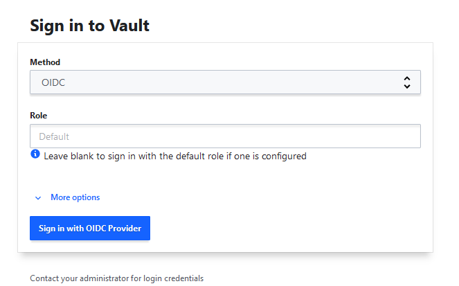

# Vault

[[toc]]

Vault is a tool for securely accessing secrets. A secret is anything that you want to tightly control access to, such as API keys, passwords, or certificates. 
Vault provides a unified interface to any secret, while providing tight access control and recording a detailed audit log.

When you create a secret in kubernetes it is stored in etcd as plain text, also the secret is accessible to anyone that has access to your cluster.

## Limitations of kubernetes secrets

1. They are not encrypted at rest.
2. By default, cluster admins can see all the secrets of all the tenants.
3. When in use (i.e. mounted as tempfs in the node that runs the pod that is using them), they can be seen by a node administrator.
4. When in use, they can be seen by anyone who has the ability to remote shell into the container.

Vault solves this issue by providing a central secret management store that provides an additional layer of security using it's
authentication methods. Secrets are only accessible when you provide a corresponding token. Vault is an application written in GO with a with a REST and CLI interface support. For access of secrets vault uses tokens.
Tokens are created on demand with a specified expiry time and can be revoked at any given time.

## Key features of Vault

1. Centralization
2. Audit Control
3. Dynamic Secrets
4. Encryption as a Service
5. Leasing, Renewal and Revocation

For detailed documentation: [Vault Documentation](https://learn.hashicorp.com/vault#getting-started)  

# Vault usage

There are 2 kinds of secrets in the vault.
* Secrets for managed applications provided by Stakater (ex: Nexus repository credential)
  Users only have read permission.
  The path is `managed-addons/*`.
* Tenant specific secrets.
  A `KV` v2 secret engine is enabled on `TENANT_NAME/kv` path in default. Even though users delete that path, it is created automatically so please don't remove that.
  Users can enable/disable secret engines on `TENANT_NAME/*` paths and create/delete/update/read secrets in them.

Users can manage secrets via vault UI or vault CLI.

## Using Vault UI

Users included in any tenants can access to the Vault UI using OIDC authentication.

Once login, users can do all actions on the path `TENANT_NAME/*`.

- Enable/disable any kinds of secret engines

- Create/update/get/list/delete secrets

**Authentication**



* Access https://stakater-vault-openshift-stakater-vault.CLUSTER_DOMAIN
* Select `OIDC` method on `Sing in to Vault` page.
* Keep `Role` as default.
* Click `Sign in with OIDC Provider`
* Then login on popup authentication dialog. The browser should allow the popup dialog.


**Enable secret engines**


**Create secrets**


## Using Vault CLI

To use vault CLI, the token is required. Users can get/renew/revoke the token on the UI. (Click the user account Avatar.)


Once token is fetched, users can use the CLI provided by UI. So there is no need to install vault CLI.


```bash
vault login token=${TOKEN}
```

## Consuming vault secrets in pods

There are different ways to consume vault secrets in a pod

1. Vault API
2. Inject secrets via sidecar

### 1. Vault API

TBD

### 2. Inject vault secrets in pods

For consuming secrets that are stored in vault, we leverage on vault agent. Vault agent adds init containers and side-car
containers for populating secrets and managing token lifecycle.


Let's go through a demonstration:

#### Make vault accessible and set environment variables

```shell script
oc port-forward -n stakater-vault service/vault 8200:8200 &`

export VAULT_ADDR=https://127.0.0.1:8200
export KEYS=`cat vault-secrets/unseal-key`
export ROOT_TOKEN=`cat vault-secrets/root-token`
export VAULT_TOKEN=$ROOT_TOKEN
```

#### Create namespace

Create a namespace to deploy our sample application that consumes secret stored in vault. We need to label the namespace
 with `vault.hashicorp.com/agent-webhook=enabled` to enable the injection of vault sidecars.
 
```yaml
apiVersion: v1
kind: Namespace
metadata:
  name: stakater-vault-demo
  labels:
    vault.hashicorp.com/agent-webhook: enabled
```

#### Create service account

```yaml
apiVersion: v1
kind: ServiceAccount
metadata:
  name: app
  namespace: stakater-vault-demo
  labels:
    app: vault-agent-demo
```

#### Create a role in vault for authentication

```shell script
# Create a role for binding the policy to a service account
vault write -tls-skip-verify auth/kubernetes/role/stakater-vault-demo-role \
        bound_service_account_names=app \
        bound_service_account_namespaces=stakater-vault-demo \
        policies=default-policy \
        ttl=24h
```

#### Create a secret

```shell script
# Write sample secret
vault kv put -tls-skip-verify secret/helloworld ttl=1m username=test-user password=dummy-pass
```

#### Add Required Annotations

To inject secrets, we must use the following annotations:

- `vault.hashicorp.com/agent-inject`: Enable or disable injection for a pod
- `vault.hashicorp.com/secret-volume-path`: Specifies the shared volume used by the Vault Agent containers for sharing secrets with the other containers in the pod.
- `vault.hashicorp.com/role:`: Specifies the role to be used for the Kubernetes auto-auth
- `vault.hashicorp.com/tls-skip-verify`: Enable or disable TLS verification while communicating with vault
- `vault.hashicorp.com/agent-pre-populate-only`: Only run init container(no side-cars), useful if secrets are not meant to be updated
- `vault.hashicorp.com/agent-inject-secret-{path-to-secret}`: Specify the secret to be retrieved
- `vault.hashicorp.com/agent-inject-template-{path-to-secret}`: Specify template to use for rendering the secrets 


#### Deploy the application

```yaml
apiVersion: apps/v1
kind: Deployment
metadata:
  name: app
  namespace: stakater-vault-demo
  labels:
    app: vault-agent-demo
spec:
  selector:
    matchLabels:
      app: vault-agent-demo
  replicas: 1
  template:
    metadata:
      annotations:
        vault.hashicorp.com/agent-inject: "true"
        vault.hashicorp.com/role: "stakater-vault-demo-role"
        vault.hashicorp.com/tls-skip-verify: 'true'
        #vault.hashicorp.com/agent-pre-populate-only: "true"
        vault.hashicorp.com/secret-volume-path: /vault/secrets/
        vault.hashicorp.com/agent-inject-secret-helloworld: "secret/helloworld"
        vault.hashicorp.com/agent-inject-template-helloworld: |
          {{- with secret "secret/helloworld" -}}
          postgresql://{{ .Data.username }}:{{ .Data.password }}@postgres:5432/wizard
          {{- end }}
      labels:
        app: vault-agent-demo
    spec:
      serviceAccountName: app
      containers:
        - image: docker.io/library/busybox
          name: app
          command: ["/bin/sh"]
          args:
            - -c
            - |
              echo "Value of secret is: "
              cat /vault/secrets/helloworld
```

#### Verify 

You can verify the workflow through logs of the application pod.
