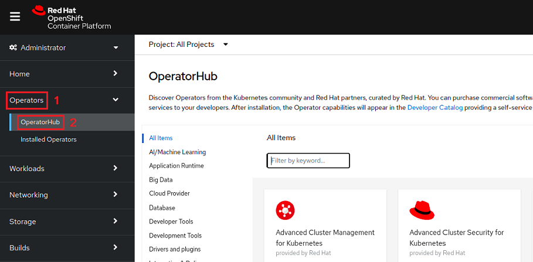
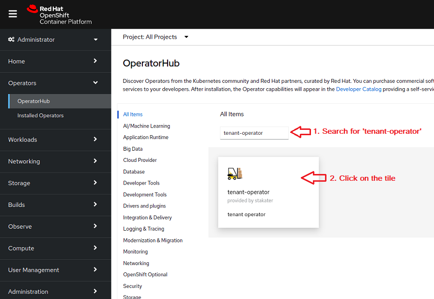
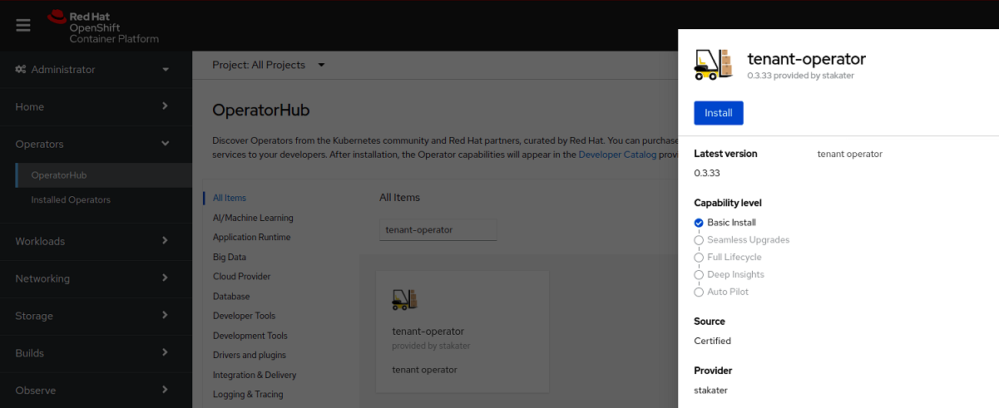
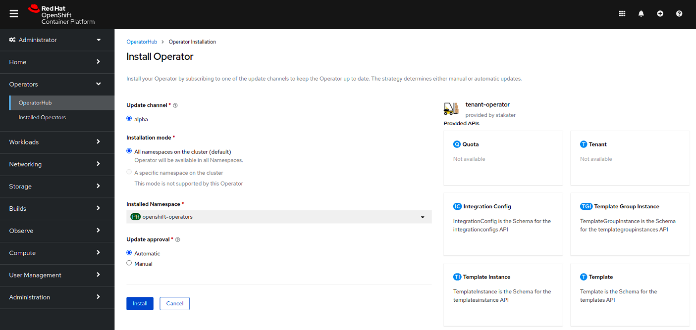
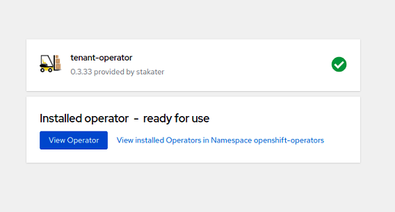
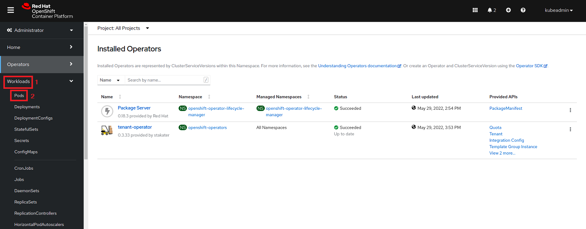
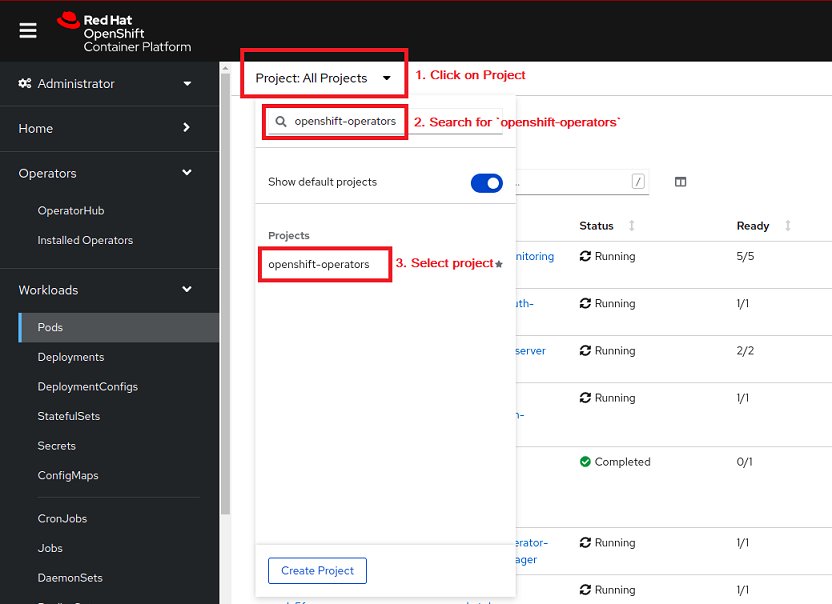
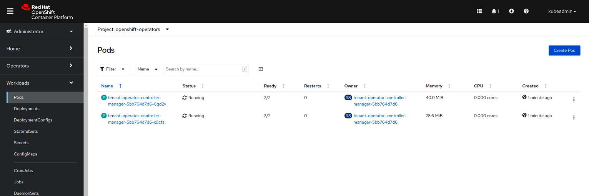

# Installation

## Requirements

* An **Openshift** cluster

## Openshift Marketplace

### 1. Installing Tenant-Operator

#### Using OperatorHub

* After opening OpenShift console click on `Operators`, followed by `OperatorHub` from the side menu



* Now search for `tenant-operator` and then click on `tenant-operator`



* Click on the `install` button



* After configuring `Update approval` click on the `install` button



* Wait for the operator to be installed


* Once Tenant-Operator has been successfully installed, Tenant-Operator will be ready to enforce multi-tenancy in your cluster



::: warning Note:

* Tenant-Operator will be installed in `openshift-operators` namespace by OperatorHub

:::

#### Using Subscription

* Create a subscription yaml for tenant-operator and apply it in `openshift-operators` namespace

```bash
$ oc create -f - << EOF
apiVersion: operators.coreos.com/v1alpha1
kind: Subscription
metadata:
  name: tenant-operator
  namespace: openshift-operators
spec:
  channel: alpha
  installPlanApproval: Automatic
  name: tenant-operator
  source: certified-operators
  sourceNamespace: openshift-marketplace
  startingCSV: tenant-operator.v0.3.33
EOF
subscription.operators.coreos.com/tenant-operator created
```

* After creating the `subscription` manifest open OpenShift console and click on `Operators`, followed by `Installed Operators` from the side menu


* Wait for the installation to complete


* Once the installation is completed we will click on `Workloads`, followed by `Pods` from the side menu



* Select `openshift-operators` project



* Wait for the pods to start


* Once pods are up and running, Tenant-Operator will be ready to enforce multi-tenancy in your cluster



### 2. Configuring IntegrationConfig

For more details check out [IntegrationConfig](https://docs.cloud.stakater.com/content/sre/tenant-operator/integration-config.html).

## Helm

### 1. Create Namespace

```bash
oc create namespace stakater-tenant-operator
```

Create a new namespace `stakater-tenant-operator`, where Tenant-Operator will be deployed.

### 2. Create Secret

```bash
oc apply -f stakater-docker-secret.yaml
```

Create a secret called `stakater-docker-secret` in *stakater-tenant-operator* namespace to pull Tenant-Operator image from dockerhub.

*The secret will be provided by **Stakater***

### 3. Add Helm Repository

In order to install Tenant Operator with Helm, first add the Stakater Helm repository.

```bash
helm repo add stakater https://stakater.github.io/stakater-charts
```

Scan the new repository for charts.

```bash
helm repo update
```

### 4. Install Tenant Operator

```bash
helm repo update

helm install tenant-operator stakater/tenant-operator --namespace stakater-tenant-operator \
--set image.repository=stakaterdockerhubpullroot/tenant-operator \
--set imagePullSecrets[0].name=stakater-docker-secret \
--set resources.limits.cpu=600m \
--set resources.limits.memory=600Mi \
--set resources.requests.cpu=100m \
--set resources.requests.memory=128Mi \
--set integrationConfig.create=true
```

Once the image has been pulled `Tenant-Operator` will be ready for use.

### 5. Configuring IntegrationConfig

A default `IntegrationConfig` is installed with tenant-operator, which can be found in `stakater-tenant-operator` namespace under the name `tenant-operator-config`. For more details check out [IntegrationConfig](https://docs.cloud.stakater.com/content/sre/tenant-operator/integration-config.html).

## Installation using Helm Release

### Requirements

* An **Openshift** cluster
* **Helm-Operator**

### 1. Create Namespace

```bash
oc create namespace stakater-tenant-operator
```

Create a new namespace `stakater-tenant-operator`, where Tenant-Operator will be deployed.

### 2. Create Secret

```bash
oc apply -f -n stakater-tenant-operator stakater-docker-secret.yaml
```

Create a secret called `stakater-docker-secret` in *stakater-tenant-operator* namespace to pull Tenant-Operator image from dockerhub.

*The secret will be provided by **Stakater***

### 3. Create Tenant-Operator Helm Release

```yaml
apiVersion: helm.fluxcd.io/v1
kind: HelmRelease
metadata:
  name: tenant-operator
  namespace: stakater-tenant-operator
spec:
  releaseName: stakater
  chart:
    repository: https://stakater.github.io/stakater-charts
    name: tenant-operator
    version: 0.2.24
  values:
    integrationConfig:
      create: true
    image:
      repository: stakaterdockerhubpullroot/tenant-operator
      tag:  v0.2.24
      pullPolicy: IfNotPresent
    imagePullSecrets:
    - name: stakater-docker-secret
    resources:
      limits:
        cpu: 600m
        memory: 600Mi
      requests:
        cpu: 100m
        memory: 128Mi
```

This helm-release will deploy tenant-operator.

Once the image has been pulled `Tenant-Operator` will be ready for use.

### 4. Configuring IntegrationConfig

A default `IntegrationConfig` is installed with tenant-operator, which can be found in `stakater-tenant-operator` namespace under the name `tenant-operator-config`. For more details check out [IntegrationConfig](https://docs.cloud.stakater.com/content/sre/tenant-operator/integration-config.html).

## Note

* If tenant-operator is deployed in a newly created namespace, restart its pod once so tenant-operator can retrieve webhook-server-cert provided by openshift(if the pod is started before the secret was made).
* For more details on how to use Tenant-Operator please refer [use-cases](../tenant-operator/usecases/quota.html).
* For more details on how to extend your Tenant-Operator manager ClusterRole please refer [use-cases](../tenant-operator/usecases/manager-clusterrole.html).
