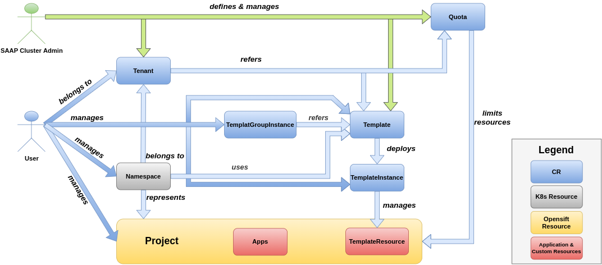

# Tenant-Operator

## Overview

OpenShift is designed to support a single tenant platform, hence making it difficult for cluster admins to host multi-tenancy in a single OpenShift cluster. If multi-tenancy is achieved by sharing a cluster, it can have many advantages, e.g. efficient resource utilization, less configuration effort and easier sharing of cluster-internal resources among different tenants. OpenShift and all managed applications provide enough primitive resources to achieve multi-tenancy, but it requires professional skills and deep knowledge of OpenShift.

This is where Tenant Operator comes in and provides easy to manage/configure multi-tenancy. Tenant operator provides wrappers around OpenShift resources to provide a higher level of abstraction to the users. With Tenant Operator admins can configure Network and Security Policies, Resource Quotas, Limit Ranges, RBAC for every tenant, which are automatically inherited by all the namespaces and users in the tenant. Depending on users role, they are free to operate within their tenants in complete autonomy. Tenant Operator supports initializing new tenants using GitOps management pattern. Changes can be managed via PRs just like a typical GitOps workflow, so tenants can request changes; add new user or remove user.

The idea of Tenant Operator is to use namespaces as independent sandboxes, where tenant applications can run independently from each other. To minimize cluster admin efforts, cluster admins shall configure Tenant Operator's custom resources, which then become a self-service system for tenants. Tenant Operator enables cluster admins to host multiple tenants in a single OpenShift Cluster, i.e.

* Share an **OpenShift cluster** with multiple tenants
* Share **managed applications** with multiple tenants
* Configure and manage tenants and their sandboxes


fig 1. Overview of Tenant Operator architecture

## Custom Resources

1. Tenant
2. Quota
3. Template
4. TemplateInstance
5. TemplateGroupInstance

### 1. Tenant

```yaml
apiVersion: tenantoperator.stakater.com/v1alpha1
kind: Tenant
metadata:
  name: development
spec:
  users:
    owner:
    - haseeb@stakater.com
    edit: 
    - hanzala@stakater.com
    view:
    - jose@stakater.com
  quota: development
  namespacetemplate:
    templateInstances:
    - spec:
        template: redis
      selector:
        matchLabels:
          app: redis
```

Defines the `users`, `quota` and `namespacetemplates` of a tenant.

* Tenant has 3 kinds of `users`:
  + `Owner:` Users who will be owners of a tenant. They will have openshift admin-role assigned to their users, with additional access to create namespaces aswell.
  + `Edit:` Users who will be editors of a tenant. They will have openshift edit-role assigned to their users.
  + `View:` Users who will be viewers of a tenant. They will have openshift view-role assigned to their users.
  + For more details [SAAP ClusterAdmin](https://docs.cloud.stakater.com/content/sre/tenant-operator/user_roles.html#tenant-roles)

* Tenant will have a `Quota` to limit resource consumption.

* Tenant will deploy `template` resources mentioned in `namespacetemplate.templateInstances`, `template` resources will only be applied in those `namespaces` which belong to the `tenant` and which have `matching label`.

### 2. Quota CR

```yaml
apiVersion: tenantoperator.stakater.com/v1alpha1
kind: Quota
metadata:
  name: development
  annotations:
    quota.tenantoperator.stakater.com/is-default: "false"
spec:
  hard:
    configmaps: "10"
    persistentvolumeclaims: "4"
    replicationcontrollers: "20"
    secrets: "10"
    services: "10"
    services.loadbalancers: "2"
```

When several tenants share a single cluster with a fixed number of resources, there is a concern that one tenant could use more than its fair share of resources. Quota is a wrapper around OpenShift `ClusterResourceQuota`, which provides administrators to limit resource consumption per `Tenant`. For more details [Quota.Spec](https://kubernetes.io/docs/concepts/policy/resource-quotas/)

### 3. Template

```yaml
apiVersion: tenantoperator.stakater.com/v1alpha1
kind: Template
metadata:
  name: redis
resources:
  helm:
    releaseName: redis
    chart:
      repository:
        name: redis
        repoUrl: https://charts.bitnami.com/bitnami
    values: |
      redisPort: 6379
---
apiVersion: tenantoperator.stakater.com/v1alpha1
kind: Template
metadata:
  name: networkpolicy
resources:
  manifests:
    - kind: NetworkPolicy
      apiVersion: networking.k8s.io/v1
      metadata:
        name: deny-cross-ns-traffic
      spec:
        podSelector:
          matchLabels:
        ingress:
          - from:
              - podSelector: {}
```

Templates are used to initialize Namespaces and share common resources across namespaces (e.g. secrets).

* They either contains one or more Kubernetes manifests or alternatively a Helm chart.
* They are being tracked by TemplateInstances in each Namespace they are applied to.
* They can contain pre-defined parameters such as ${namespace} or user-defined ${MY_PARAMETER} that can be specified within an TemplateInstance.

Also you can define custom variables in `Template` and `TemplateInstance` . The parameters defined in `TemplateInstance` are overwritten the values defined in `Template` .

<details open>
  <summary>Manifest Templates</summary>
  <p>The easiest option to define a Template is by specifying an array of Kubernetes manifests which should be applied when the Template is being instantiated.</p>
</details>
<details open>
  <summary> Helm Chart Templates</summary>
  <p>Instead of manifests, a Template can specify a Helm chart that will be installed (using helm template) when the Template is being instantiated.</p>
</details>

#### Mandatory and Optional Templates

 Templates can either be mandatory or optional. By default, all Templates are optional. Cluster Admins can make Templates mandatory by adding them to the `spec.namespacetemplate.templateInstances` array within the Tenant configuration. All Templates listed in `spec.namespacetemplate.templateInstances` will always be instantiated within every `Namespace` that is created for the respective Tenant.

### 4. TemplateInstance

```yaml
apiVersion: tenantoperator.stakater.com/v1alpha1
kind: TemplateInstance
metadata:
  name: redis
  namespace: build
spec:
  template: redis
  sync: false
```

TemplateInstance are used to keep track of resources created from Templates, which are being instantiated inside a Namespace.
Generally, a TemplateInstance is created from a Template and then the TemplateInstances will not be updated when the Template changes later on. To change this behavior, it is possible to set `spec.sync: true` in a TemplateInstance. Setting this option, means to keep this TemplateInstance in sync with the underlying template (similar to helm upgrade).

### 5. TemplateGroupInstance

```yaml
apiVersion: tenantoperator.stakater.com/v1alpha1
kind: TemplateGroupInstance
metadata:
  name: redis-instance
spec:
  template: redis
  tenant: development
  selector:
    matchLabels:
      app: redis
  sync: true
```

TemplateGroupInstance distributes a template across multiple namespaces which are selected by labelSelector.
It specifies the matching labels and tenant name.

### Namespace

```yaml
apiVersion: v1
kind: Namespace
metadata:
  labels:
    stakater.com/tenant: development
  name: build
```

* Namespace should have label `stakater.com/tenant` which contains the name of tenant to which it belongs to. The labels and annotationos specified in the operator config,  `ocp.labels.project` and `ocp.annotations.project` are inserted in the namespace by the controller.

## Note

* `tenant.spec.users.owner`: Can only create *Namespaces* with required *tenant label* and can delete *Projects*. To edit *Namespace* use `GitOps/ArgoCD`
